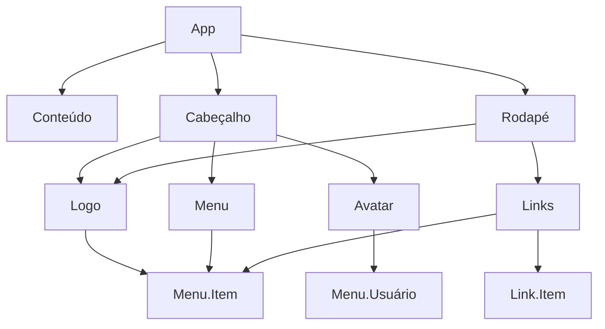

```mermaid
graph TD;
  App--> Conteúdo;
  App--> Cabeçalho;
  Cabeçalho--> Logo --> Menu.Item;
  Cabeçalho--> Avatar --> Menu.Usuário;
  Cabeçalho--> Menu --> Menu.Item;
  App--> Rodapé;
  Rodapé --> Logo;
  Rodapé --> Links;
  Links--> Link.Item;
  Links--> Menu.Item;
```

```mermaid
flowchart TD
    A[christimas]-->|get money| B(go shopping)
    B-->C{let me think}
    C--> |One|    D[laptop]
    C--> |Two|    E[iphone]
    C--> |Three|  F[fa: fa-car Car]
```
